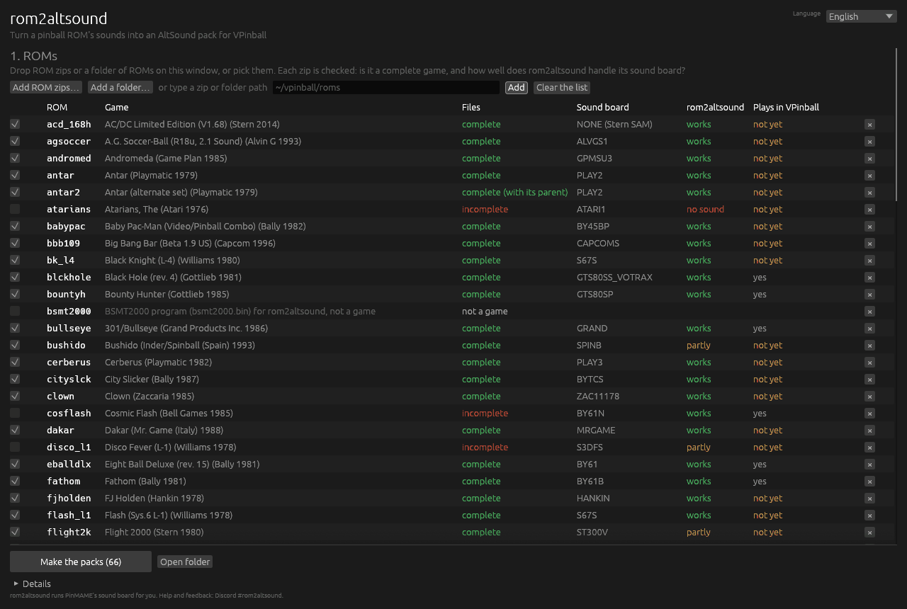
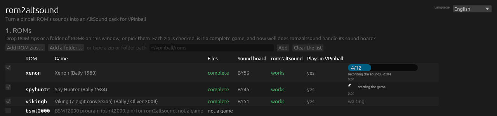
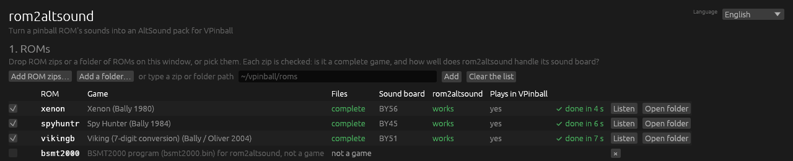
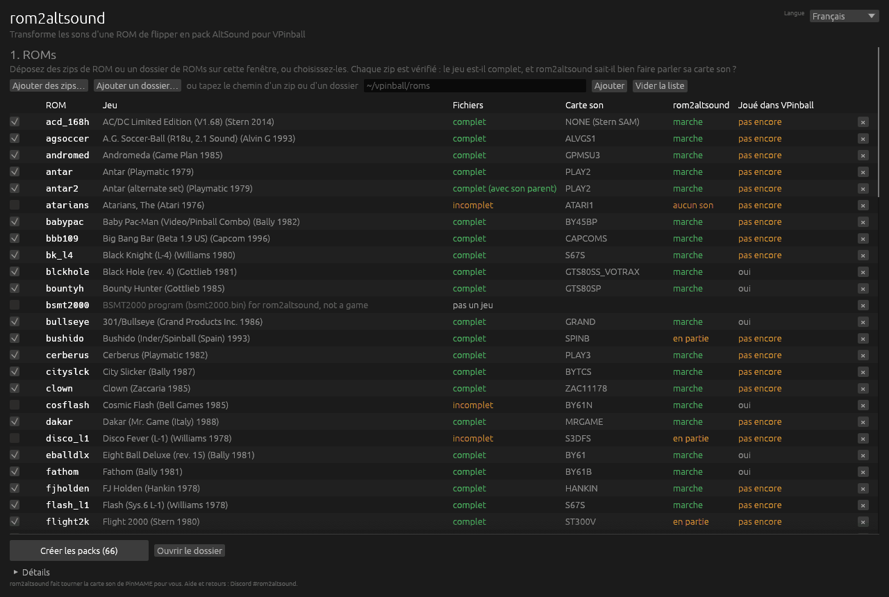

 [English](#english) |  [Français](#français)

# rom2altsound

## <a name="english"></a> English

**rom2altsound turns a pinball ROM's sounds into an AltSound pack for Visual Pinball.**

**[Sound ROM catalog](https://le-syl21.github.io/rom2altsound/)**: every sound ROM PinMAME knows,
by sound ROM id, with its games, its sound board, how far rom2altsound gets with it and the
number of tracks read from the ROMs (data only: no ROM, no sound).

> **0.2.2.** The packs it writes play in VPinball (Stern SAM packs
> not yet, see [Stern SAM](#stern-sam)); please report what you find (see
> [Help and feedback](#help-and-feedback)). What is in it: [CHANGELOG.md](CHANGELOG.md).

### What it does

Give it a ROM zip (`afm_113b.zip`) and it:

1. runs PinMAME (the emulator VPinball uses) inside the program, without a window;
2. sends every sound command of the ROM to the emulated sound board, one after another;
3. records each one to its own WAV file, all at the volume the game itself sets from its
   factory settings (its factory volume);
4. finds where music loops and cuts it to its intro plus **one exact cycle**, so that it
   loops without a seam (a music whose loop follows an intro, a fanfare for example, also
   gets a 5-minute file: the intro, then the cycle repeated);
5. writes a folder that VPinball's AltSound plugin reads as is: the WAV files,
   `altsound.csv`, `g-sound.csv`, `altsound.ini`, and `manifest.json` with everything
   that was measured.

Stern SAM machines have no sound board to drive: their sounds are read straight from the
ROM image instead (see [Stern SAM](#stern-sam)).

### Why not PinMAME's own sound dump?

PinMAME can record its output while you play sounds by hand (the sound commander, F4).
That gives one long recording, or one file per sound at best, that you then cut, name,
level and loop yourself, sound by sound. rom2altsound does it all in one go:

- **every command**, named from PinMAME's `sounds.dat`, plus the DCS tracks it does not list;
- **clean files**: each sound starts from silence, with the silence before and after trimmed;
- **one volume** for the whole ROM, the game's own factory volume, set the way the game
  sets it, so every sound keeps its level relative to the others;
- **exact loops**, found in the audio and, on DCS boards, in the sound program of the ROM
  itself; on the older boards, one cycle of the music's score, found in the state of the
  board's processor;
- **a ready AltSound pack**, not just a pile of WAV files;
- it runs **many times faster than real time** (an AFM ROM takes about 2 minutes).

### Install

**Release binaries** (Linux x86_64/aarch64, Windows x86_64, macOS arm64/x86_64): download
the archive for your system from the
[releases page](https://github.com/Le-Syl21/rom2altsound/releases), unpack it and run
`rom2altsound` from a terminal. The Windows and macOS binaries are signed. Prefer a
window to a terminal? Take the `rom2altsound-gui-…` archive instead (see
[The window program](#the-window-program)).

**With Cargo** (needs Rust, CMake and a C/C++ compiler; PinMAME is built along the way,
which takes a few minutes):

```
cargo install --git https://github.com/Le-Syl21/rom2altsound rom2altsound
cargo install --git https://github.com/Le-Syl21/rom2altsound rom2altsound-gui   # the window
```

### The window program

`rom2altsound-gui` does what the command line does, in a window: no terminal, no option
to remember. It is a separate download (`rom2altsound-gui-<system>` on the
[releases page](https://github.com/Le-Syl21/rom2altsound/releases); on macOS an
application, `rom2altsound.app`), so that the command line one stays small.



1. **ROMs**: drop ROM zips or a whole ROM folder on the window (or pick them, or type a
   path). Each zip is checked as `rom2altsound roms` checks it: is the game complete
   (or complete with its parent's zip next to it), damaged, misnamed; its sound board;
   how far rom2altsound gets with that board; and whether VPinball plays the pack today.
   Hover a word for the explanation. The complete games are ticked.
2. **Where the packs go**: each ROM gets its folder in it (proposed: an `altsound`
   folder next to the ROMs).
3. **Options**, in plain words: the volume of the files (the game's factory volume, or
   the loudest that does not distort), how many ROMs at the same time, the longest
   sound, your own sounds.dat or names.csv. **Advanced options** lists every other option
   of the command line, with its help.

**Make the packs** shows each ROM's progress (its stage, and the command being recorded
out of how many) and the overall one; **Cancel** stops everything at once. **Details**
holds what each ROM printed. At the end, **Listen** opens a pack's listening page in
your browser, **Open folder** its folder, and **Page of every ROM** the page linking them.




The window follows the system language (English or French) and has a switch for it.
It runs the very same extraction as the command line (each ROM in a process of its
own); given arguments, `rom2altsound-gui` *is* the command line.

### Usage

```
rom2altsound afm_113b
```

looks for `afm_113b.zip` in the current folder, then in `./roms`, and writes the pack to
`./afm_113b/`. More examples:

```
rom2altsound ~/vpinball/roms/mm_109c.zip           # a ROM given by its zip
rom2altsound afm_113b cv_20h rs_l6 --roms ~/vpinball/roms --out ~/packs
                                                   # three ROMs, two at a time, in ~/packs/<rom>/
rom2altsound afm_113b --jobs 1 --merge-twins       # see "Twins" below
rom2altsound afm_113b --check-ducking              # DCS: replay the ducking and check it
rom2altsound afm_113b --volume reference           # louder files, see "Volume" below
rom2altsound --help                                # every option
```

Several ROMs run two at a time by default (`--jobs` to change it); then each ROM's progress
goes to `rom2altsound.log` in its folder. A ROM that fails does not stop the others, and a
recap is printed at the end.

To check a ROM folder first:

```
rom2altsound roms ~/vpinball/roms                  # what each zip really holds
rom2altsound roms ~/vpinball/roms --fix-names ~/roms-fixed --json roms.json
```

Each zip is identified by its content, against the ROM tables of the PinMAME built in, not
by its name: the set(s) it holds, a bad dump (a file with a wrong CRC), missing files,
files that are no ROM, a zip named after another set, merged zips. Each game also gets its
sound board and its sound ROM id, the same for all the revisions of a game that share
their sound ROMs. Nothing is changed in your folder; `--fix-names` writes correctly named
zips (or links) to another one. See [how it works](docs/how-it-works.md#rom-verification).

The [catalog site](https://le-syl21.github.io/rom2altsound/) is built from a ROM folder the same
way, metadata only (names, sizes, checksums, counts), then the pages around it:

```
rom2altsound catalog ~/vpinball/roms --out docs/catalog.json
python3 docs/build_site.py
```

Then copy the ROM's folder next to your table, as `<table folder>/altsound/<rom>/` (for
example `Tables/Attack from Mars/altsound/afm_113b/`), and turn on the AltSound plugin in
VPinball.

### What you get

```
afm_113b/
├── 0x0001-afm_113b.wav         intro + one loop cycle, with its loop points (WAV smpl chunk)
├── 0x0001-afm_113b-loop.wav    the loop alone (what AltSound plays, looped)
├── 0x0009-afm_113b-extended.wav  a loop with an intro: the intro + 5 minutes of cycles
│                               (what AltSound plays, once)
├── 0x0064-afm_113b.wav         one file per command
├── ...
├── altsound.csv                AltSound format (selected in altsound.ini)
├── g-sound.csv                 G-Sound format (set format = g-sound in altsound.ini to use it)
├── altsound.ini                format, and the ROM's volume control turned off
├── manifest.json               every measure: names, lengths, loudness, loops, twins...
├── index.html                  a page to listen to every sound in a browser (see below)
├── cold-boot.json              how the factory boot went
└── factory-nvram/afm_113b.nv   the factory settings the ROM was played with
```

Every gain is 100: the files already carry the ROM's own levels.

**`index.html` lists every sound in a table, with play buttons**: open it straight from
the folder (double-click, no server, no internet needed). One row per sound: its command,
its name, its type, its length, its loudness and true peak, its loop (period, intro, how
it was found; and a button for the loop alone), its channel, DUCK and STOP when known, its
twin and what is unusual about it (clipped, blip...). Click a column title to sort by it
(again to reverse; the page remembers it); a search box and filters (music, voices,
effects, loops only) help find one; Space or Enter plays the selected sound and the arrow
keys move. On a phone the table scrolls sideways. With several ROMs, an `index.html` in
the output folder links each ROM's page. `--no-html` skips them.

**Naming sounds**: many sounds have no name (sounds.dat does not list them, or there is no
sounds.dat section, as on Pinball 2000). Click ✎ (or press F2) on a row, type a name,
Enter keeps it, Escape cancels, an empty name means no name. Your names are marked
"edited", can be searched and sorted, and are kept by the browser for this ROM. **Export
names** saves them, with the pack's other names, to a `names.csv`; **Import names** loads
one back (someone else's, for example); **Clear my edits** forgets yours. Then put the
names in the pack:

```
rom2altsound names afm_113b names.csv      # altsound.csv, manifest.json and index.html
rom2altsound afm_113b --names names.csv    # or when the pack is (re)built
```

Only the NAME column changes: the WAV files keep their id-based names, and the channels,
DUCK and STOP stay as extracted. Ids not in the pack are reported and left out. Names
belong to a sound ROM, not to a game version: the file carries the sound ROM id (see
`rom2altsound roms`), every revision of a game that shares its sound ROMs takes the same
file, and a file made for other sound ROMs is refused (`--force`, or `--force-names` on
an extraction, applies it anyway). `rom2altsound names afm_113b` alone prints the pack's
names as a `names.csv`.

**A/B test** (goodtwist's idea): copy the folder (`taf_l5` to `taf_l5-edit`), replace
sounds in the copy, then type `../taf_l5-edit/` in the page's "Compare with folder" box
(the page remembers it). Each sound gets an **A/B** button that switches the player
between this folder's file (A) and the file of the same name in the other folder (B),
at the same position and without stopping; the `b` key does the same. The player shows
which side is playing, and a sound that is not in the other folder is marked "missing
in B".

**On DCS boards (Williams/Bally 1993-1999), the mix comes from the ROM itself.** Each DCS
sound command is a small program that says which of the board's channels it plays on and
how much it lowers the others while it plays. rom2altsound reads those programs, so in the
pack:

- the music is the music channel (a new music replaces the previous one);
- the one voice channel that has no twin (on Attack from Mars, the General) becomes the
  jingle channel, where a new line cuts the previous one, as on the machine;
- each sound lowers the music (**DUCK**) exactly as much as the ROM does: on Attack from
  Mars a callout lowers it by 2.4 or 3.5 dB (DUCK 76 or 67), a fanfare by 16 to 24 dB
  (DUCK 15 to 7). `g-sound.csv` gets the same depths as ducking profiles in
  `altsound.ini`;
- `--check-ducking` plays the music with one sound per depth on top and checks that the
  emulated board really lowers it that much (within 0.5 dB).

AltSound cannot do everything the board does: it gives the music its level back at once
when a sound ends, where the board fades it back over about 0.15 s, and when two sounds
overlap it keeps only the deepest duck, where the board adds them up
([libaltsound issue #15](https://github.com/vpinball/libaltsound/issues/15)).

**On WPCS and System 11 boards (Williams 1987-1993), the mix is measured.** Each sound is
played again with only one chip of the board heard (PinMAME's mixer can mute a chip): with
the voice chip alone, to tell what plays on it (it plays one sound at a time, so these go
on the jingle channel, where a new one cuts the previous), and over a music with the music
chip alone, to see whether the sound lowers the music (**DUCK**), stops it (**STOP**, or the
music channel for a sound that ends it). On Twilight Zone, FM jingles and effects lower the
music by 2 to 14 dB while they play; voice lines barely touch it.

**On the other boards**, the sound programs are code for the board's own processor, with
nothing that says how one sound changes another, so the pack makes nothing up: music on
the music channel (loops and sounds named "Music:"), the rest as sound effects, voice lines
as callouts in `g-sound.csv`, no ducking (DUCK 100) and no stops (STOP 0).

**The pack is a starting point.** The artistic pass, i.e. changing what the ROM does, the
ducking on non-DCS boards, and the gains, is yours to do in an AltSound editor such as
**VPin Studio**.

### Supported boards

What rom2altsound gets out of each sound board family:

| family | sounds | exact loops | factory volume | ducking (DUCK) | stops (STOP) | channels (CHANNEL / TYPE) |
|---|---|---|---|---|---|---|
| Williams/Bally WPC DCS (1993-1999) | ✅ | ✅ | ✅ | ✅ | ✅ | ✅ ¹ |
| Midway Pinball 2000, DCS2 (1999) ¹⁶ | ✅ | ✅ | ✅ | ❌ | ❌ | ❌ |
| Williams WPCS (1991-1993) | ✅ ² | ⚠️ ⁵ | ✅ ⁸ | ✅ ¹¹ | ✅ ¹¹ | ✅ ¹¹ |
| Williams System 11 | ✅ | ⚠️ ⁵ | ✅ ⁴ | ✅ ¹¹ | ✅ ¹¹ | ✅ ¹¹ |
| Data East (BSMT) ⁹ | ✅ | ⚠️ ³ | ✅ ⁴ ⁶ | ❌ | ❌ | ❌ |
| Sega / Stern Whitestar (BSMT) ⁹ | ✅ | ⚠️ ³ | ✅ | ❌ | ❌ | ❌ |
| Stern SAM | ✅ ⁷ | ✅ ⁷ | ✅ ⁷ | ❌ | ❌ | ❌ |
| Bally Cheap Squeak / Turbo Cheap Squeak | ✅ ¹⁰ | ⚠️ ⁵ ¹⁰ | ✅ ⁴ | ❌ | ❌ | ❌ |
| Bally Sounds Plus -51 (1979-1983) ¹² | ✅ ¹³ | ⚠️ ¹³ | ✅ ⁴ | ❌ | ❌ | ❌ |
| Bally Sounds Plus -56, with speech (1980-1981) ¹² | ✅ ¹³ | ⚠️ ¹³ | ✅ ⁴ | ❌ | ❌ | ❌ |
| Bally Squawk & Talk -61 (1981-1982) ¹² | ✅ ¹⁴ | ❌ ¹⁴ | ⚠️ ¹⁴ | ❌ | ❌ | ❌ |
| Bally -32 / -50 (1978-1980) ¹² | ✅ ¹⁵ | ❌ | ✅ ⁴ | ❌ | ❌ | ❌ |
| No sound command: Stern SB-300 (1979-1982), Atari (1976-1979), Romstar's Goofy Hoops (1994) ¹⁷ | ✅ ¹⁷ | ⚠️ ¹⁷ | ✅ ¹⁷ | ❌ | ❌ | ❌ |

Every sound board family of PinMAME, with its number of games and a quick survey of
one ROM per family of the full VPinMAME set (22 more families give sounds): [board
support](docs/board-support.md).
How rom2altsound drives each family, step by step: [sound board families](docs/families/README.md).

✅ verified, ⚠️ partial, ❌ not available, ❔ untested. "Factory volume": every file at the
master volume the game itself sets at boot from its factory settings (DCS `55 AA 67 98`
on most games, WPCS `79 0C F3`, Whitestar `FE 2C FD` on Apollo 13, SAM's DAC attenuation),
or at the board's only level where it has no volume stage. The files are then as loud as
the game plays them out of the box, which can be quiet: Attack from Mars peaks at about
-26 dBFS, Apollo 13 lower still (see [Volume](#volume)). Where ducking, stops and channels
are ❌, the pack has the defaults: DUCK 100,
STOP 0, music (loops and "Music:" names) on the music channel, the rest polyphonic.

1. Read in the ROM's own sound programs and measured (`--check-ducking`) on Attack from Mars;
   sounds, loops and volume also on Cirqus Voltaire, Medieval Madness and Red & Ted's
   Road Show. The pre-WPC95 DCS games (1993-1995) are verified for sounds only, in the quick
   survey of [board support](docs/board-support.md): Indiana Jones, Theatre of Magic.
   AltSound keeps the music and one voice channel exclusive; see Limits.
2. Verified on Twilight Zone (302 of its 307 commands, named from sounds.dat) and on
   The Addams Family (taf_l5, no sounds.dat section: the raw sweep, second bank `7A xx`
   included, wrote 268 sounds, 15 of its 33 musics with an exact loop; none clips at the
   factory volume `79 0C F3`, 5 do at `79 14 EB`).
3. The music also plays from the BSMT2000's own sample streams, which the state of the
   board's processor does not hold (see 5): few loops are found. X-Files: 5 of its 40
   musics (and its 3 test tones, sample-exact); Apollo 13 and the Data East games tried
   (Guns N' Roses, Batman): none. The others are cut at 2 minutes (`--max-secs`).
4. No software volume stage: the output is always at full scale, the board's only level
   (`full_scale (no volume stage)` in `manifest.json`).
   Checked in PinMAME's board code: nothing on these boards scales the sound.
5. The audio of a music never repeats sample-exactly on these boards, but the music's
   program does: its loop is found in the state of the board's processor, checked on the
   audio, and the file holds one cycle of the score, cut where two cycles differ least
   (a seam of a few LSB). Twilight Zone: 26 of its 45 musics within the default 4 minutes,
   31 with `--loop-max-secs 600` (`03` loops after 4.5 minutes); Whirlwind: 14 of 22,
   17 with `--loop-max-secs 600`. A music that does not loop within the search is cut at
   2 minutes (`--max-secs`).
6. The master volume is a knob in the power box, not in the software. The bytes `20`..`2F`
   are a music level the game drives (a music can fade it): the files are recorded at the
   one the game sends at boot, else the board's default, its loudest, `20`.
7. Read from the ROM image, without emulation (see [Stern SAM](#stern-sam)); verified on
   AC/DC LE 1.68. Every sound, and every version of every song as one continuous file,
   looped where the game loops it. The files are at the factory volume, read in the
   DAC, where the game writes the operator's volume setting (AC/DC: `E8`, played by
   PinMAME at -1.8 dB; -11.5 dB by the DAC's datasheet) (verified: the coin door's volume buttons move it 1 dB per press, and the game
   writes the new value at its next power-up). **The pack does not play in VPinball
   today**: SAM sends no sound command, so PinMAME has nothing to hand to AltSound.
8. Recorded at `79 0C F3`, level 12, the game's own factory volume (the master volume runs
   from `00` to `1F`, the board ignores `20` and above), the loudest level at which no
   file of The Addams Family or Twilight Zone clips. The board's DAC is AC-coupled, as on
   the real board: PinMAME maps it unsigned (code 0 = output 0) while the sounds play
   around its middle code and leave it on their last value, a DC level in the mix that
   the real board's output never passed on; every file of The Addams Family started on
   one, and its loudest effects clipped on it. Without that DC no source clips on its
   own, even at level 31, but five effects of The Addams Family that play speech, music
   chip and DAC together still clip on their sum in PinMAME's mix above level 12 (2
   samples at 13, 43 at 20, 945 at 31). `--wpcs-volume` sets another level (`16` gives
   the level of 0.2.1 back, with `--volume reference`).
9. With the BSMT2000's own program (see [The BSMT2000 program](#the-bsmt2000-program)) the
   real chip runs: ADPCM sounds come out exactly, without clipping, and Monopoly gains 43
   sounds. Without it, PinMAME's older emulation of the chip is used.
10. Verified on Spy Hunter (Cheap Squeak: 53 sounds), Motordome (Turbo Cheap Squeak: 64)
    and City Slicker (Turbo Cheap Squeak 2: 133), with no option to add. The stop between
    sounds is `00`; a music it does not stop is ended by a sound board reset, after which
    the tool waits out the Turbo Cheap Squeak's 5 s self-test. Music loops (see 5): Spy
    Hunter 2 of 2, City Slicker 7 of 10; none of Motordome's 5, whose program keeps a few
    bytes that drift against the music.
11. Measured chip by chip (see [how it works](docs/how-it-works.md)): each sound is played
    again with only the voice chip heard, and over a music with only the music chip heard.
    A sound on the voice chip, which plays one sound at a time, goes on the jingle channel
    (a callout, unless named as an effect); DUCK is how much a sound lowered the music; a
    jingle that stopped it has STOP 1, another sound that ended it goes on the music
    channel. Twilight Zone: 141 of 257 sounds on the voice chip, 40 lower the music (FM
    jingles and effects by 1.7 to 13.8 dB, as they take some of its voices; voice lines by
    2.4 dB at most), the tilts stop it; Whirlwind: 53 of 167 on a voice chip, none lowers
    the music, 11 sounds of the music board end it. Measured over one music: a sound can
    lower another music differently.
12. **These packs do not play in VPinball as they are.** Their files are keyed by the
    command the game sends (`0x1D`), but on these machines PinMAME hands AltSound
    something else: every write of the four lines the game shares between its solenoids
    and its sound board, 4 bits at a time, paired two by two. They are there to listen
    to, edit and measure the sounds, and for an AltSound that would read these boards'
    commands.
13. Verified on Viking (7-digit conversion, -51: 30 sounds from its 32 commands) and Xenon
    (-56: 49 sounds, 20 of them speech). The -51 takes five lines, commands `00`..`1F`;
    the -56 takes a byte as two nibbles on four lines, which PinMAME's sound commander
    cannot send: rom2altsound puts the high nibble on the lines once the board has read
    the low one, from its own glue code (PinMAME is not changed). The stop is `1E` on the
    -51 and `05` on the -56; after a reset these programs wait 7 s before they take a
    command. Loops: Viking 3 of its 4 sounds that keep playing (exact, from the audio);
    its background hum, `1D`, never repeats. Xenon 1 of 2; its other one, `1A`, repeats in
    the sound processor every 2.6 s, but not in the audio (probably the AY-3-8910's noise,
    which is not part of the processor's state). Sounds that do not loop are cut at 2
    minutes (`--max-secs`). Each game has its own sound program: only these two were tried
    (PinMAME knows 33 games on the -51, 5 on the -56).
14. Verified on Eight Ball Deluxe: 85 sounds from 222 commands, 53 of them speech (the
    TMS5200). `05` stops (it turns the background off); `06` turns the background on,
    which the program starts once the next command is done, so `04`, a command that does
    nothing, is sent after it. The background changes as it plays (it speeds up for more
    than an hour) and does not loop: it is cut at 2 minutes. The board's DAC holds the
    last level a sound left it at, which PinMAME passes on as DC (up to -14 dBFS), so
    these files are written DC-blocked, as the board's AC-coupled output would be
    (`dc_blocked_wav` in `manifest.json`). The board has volume lines, for the sounds and
    for the speech, that the game sets with commands (`DF`..`FE`), but PinMAME does not
    emulate them: the files are at full scale (`full_scale (volume lines not emulated in
    PinMAME)`) and the game's own volume is not known. Five speech
    lines touch full scale for 2 or 3 samples, in PinMAME's own mix. The -61B variant gives
    sounds too (Fathom, quick survey: 32 of its first 40 commands).
15. No sound processor: one tone per command, `00`..`1F` swept, `0F` as the stop. Verified
    on Lost World (quick survey, see [board support](docs/board-support.md)): 15 tones from
    its 32 commands.
16. Revenge From Mars and Star Wars Episode I. Verified on Star Wars Episode I 1.30 (683
    sounds from the 690 tracks of its sound ROMs' catalog, 26 loops, 24 of them exact from
    the track programs, none clipped) and Revenge From Mars 1.20 (1538 sounds from 1557 tracks, 34 loops, all exact, none clipped). The game
    is a PC that talks to its sound board in 16-bit words: rom2altsound sends the game's
    own requests, volume and stop, read in its code, and sets the board up itself when
    the game's boot does not (Revenge From Mars 1.20). Factory volume: level 12 (`55AA
    609F`), recorded at level 20 and scaled by the measured -10.6 dB. No sounds.dat
    section: the files are named by track number. The ducking, stops and channels are
    not read: the game picks a sound's board channel itself. **The pack does not play in
    VPinball today**: the game's requests do not go through PinMAME's sound command path,
    so AltSound receives none. A version's zip holds only its update files:
    `rom2altsound roms --fix-names` builds a complete set with MAME's `rfmpb.zip` /
    `swe1pb.zip` (see [ROM verification](docs/how-it-works.md#rom-verification)).
17. **No sound command: the game's own sounds.** On these boards the game's CPU plays every
    sound itself (it writes the timers, the tone latches or the QSound chip, step by step)
    and sends no command: there is nothing to sweep. rom2altsound reads the game's sound
    layer in its program instead: the request its code makes for a sound (Stern: a script
    pointer in RAM; Atari: a counter, a slot or a pending count per sound; Goofy Hoops: its
    play routines, called) and every sound the program asks for. The game is left running
    in attract mode and asked for each sound as its own code does; the stop is the game's
    own. Verified on the 15 Stern SB-300 programs (308 sounds, MOD sets included) and its
    Astro board tester, on the five Atari generation 1 games and the three generation 2
    ones, and on Goofy Hoops (63 effects, 9 songs): every file from silence. The ids are
    the game's internal sound ids (a script address, a sound number, a sequence address),
    not commands; loops come from the audio only; the volume is the one the game plays
    at. **These packs do not play in VPinball**: no command reaches AltSound on these
    machines. They are a recording of the game's sounds, to listen to, measure and keep
    (see [game-driven boards](docs/families/common.md#game-driven-boards)).

### Volume

Every file is at the **factory volume**: the master volume the game itself sends its
sound board at boot, once it has written its factory settings (rom2altsound boots each
ROM cold in a private PinMAME folder, then warm from the nvram it wrote, so your own
settings are never used). That is the level the game plays at out of the box, on every
board family, whatever the table:

| family | factory volume (examples) | files |
|---|---|---|
| DCS | `55 AA 67 98`, level 12/31 (Attack from Mars, and the board's own default when a game sends none) | about 22 dB below the old reference: Attack from Mars peaks at about -26 dBFS |
| Pinball 2000 | `55AA 609F`, level 12/31 (Star Wars Episode I, Revenge From Mars) | recorded at level 20, scaled -10.6 dB: Star Wars Episode I peaks at -16.4 dBFS |
| WPCS | `79 0C F3`, level 12/31 (Twilight Zone, The Addams Family) | unchanged: it was already the reference |
| Whitestar | `FE 2C FD`, level 3/31 (Apollo 13, Monopoly) | 25 to 33 dB below the old reference (Monopoly -24.6 dB, Apollo 13 -32.6 dB) |
| Stern SAM | DAC attenuation `E8` (AC/DC), played by PinMAME at 81 % | 1.8 dB below full scale (see [Stern SAM](#stern-sam)) |
| System 11, Data East, Bally | no volume stage: full scale, the only level | unchanged |

**How**: the sounds are recorded at the reference volume (below), the loudest that does
not clip, and every analysis runs on those recordings: silence trimming, where a sound
ends, loops, twins, the chips pass. Only then are the files written again at the factory
volume, scaled by the board's **factory offset**, measured by playing a few files again at
the factory volume (Attack from Mars: -22.44 dB, the same on every file to 0.02 dB). At
22 dB down, PinMAME's ±1 LSB dither would weigh 22 dB more against a quiet signal, and loop
points, loop checks and twin tests would suffer from it: recorded loud and scaled after,
they are the same as at the reference volume, and the files are at the factory level all
the same (checked on the replayed files, `scaled_minus_replay_db`: on Attack from Mars each
one within 0.02 dB of what PinMAME plays at the factory volume; Whitestar sounds follow the
master volume less tightly, Monopoly's within 0.25 dB). The gain is applied in floating point and
the result rounded once to 16 bits with a ±1 LSB TPDF dither, as PinMAME's mixer rounds
its own output; a 24-bit file would hold nothing more, so the files stay 16-bit.

`manifest.json` says, per board, which volume the files are at and where it comes from
(`recorded_volume`), the gain applied (`factory_gain`), and the measured offset
(`factory_offset`, with each replayed file). A board without a volume stage is recorded at
its only level, and a board the game leaves at its power-on level (no volume sent at
boot) is recorded there: neither is scaled. A sound that does not follow the master
volume (flagged `ignores_master_volume`) is played again at the factory volume and scaled
by its own move. A file that clipped in the recording, in
PinMAME's own mix, is listed (`clipped_files`, and a `CLIPPED` line in the summary);
nothing is lowered to hide it.

`--volume reference` writes the files at the **reference volume** instead, as 0.2.1 did:
per board family, the loudest master volume at which no file clips in emulation (DCS
`55 AA EF 10`, Pinball 2000 `55AA A05F`, level 20, with some margin: Star Wars Episode
I's loudest sound peaks at -5.8 dBFS there, WPCS `79 0C F3`, Whitestar `FE 11 FD`, SAM at
full scale). `--dcs-volume`,
`--wpcs-volume` and `--whitestar-volume` set those bytes (and imply `--volume
reference`).

### Stern SAM

Stern SAM machines (2006-2014, from World Poker Tour to The Walking Dead) have no sound
board and no sound CPU: the game's own processor mixes every sound in software. There is
nothing to send a command to, so rom2altsound reads the sounds from the ROM image itself,
in seconds and without emulation (AC/DC LE: 25 s for 951 sounds and 4.5 hours of music,
every version of every song). The format was worked out by Ashram56 on Tron LE
([Tron-Legacy-LE-ROM-Decryption](https://github.com/Ashram56/Tron-Legacy-LE-ROM-Decryption)),
and checked on AC/DC.

```
acd_168h/
├── s0008-acd_168h.wav          one file per distinct sound, named after its sample id,
│                               mono at the ROM's own rate (24 kHz, or 12 kHz for most voices)
├── s0123-l2-acd_168h.wav       a voice line in another language, on a ROM that has its own
│                               (AC/DC LE has five language slots, all the same)
├── s0175-acd_168h.wav          a song as one continuous file (24 kHz)
├── s001E-acd_168h.wav          a loop: intro + one cycle, with its loop points (smpl)
├── s001E-acd_168h-loop.wav     ...the cycle alone, s001E-acd_168h-extended.wav the intro + 5 min
├── altsound.csv, g-sound.csv   keyed by the game's sound calls (see below)
├── altsound.ini
├── manifest.json               sample ids, calls, songs, languages, lengths, loudness
├── cold-boot.json
└── factory-nvram/acd_168h.nv
```

- **Music**: the game plays a song in chunks of 1 to 2.5 s, chained by a script. Each
  script becomes one file, the chunks joined without a gap and the click at each join
  smoothed out (each chunk restarts its decoder, which clicks on the machine too). AC/DC
  has 24 songs, each in several versions: the song-select teaser (it loops), the in-game
  one (picks up after the teaser; songs 1-12 and 18 loop), a resume version and the full
  song. A loop is the script's own: exact, with its loop points in the file.
- **Volume**: the files hold the samples as stored, at the factory volume as PinMAME plays
  it. rom2altsound boots the game in PinMAME (cold to write its factory settings, then
  warm from them) and reads what it writes to its DAC (a TI PCM1755): AC/DC writes `E8`.
  PinMAME turns that register into a mixer level of `(E8 & 7F) * 100 / 7F` = 81 %, -1.8 dB,
  and the samples are scaled by that, so that the files sound as VPX players hear the game
  today (`recorded_volume`, `factory_gain` and `factory_offset_db` in `manifest.json`;
  `--volume reference` keeps them at full scale, what the DAC plays at 0 dB). By the DAC's
  datasheet, `E8` is -11.5 dB (0.5 dB per step from `FF`): the real machine plays about
  10 dB quieter than PinMAME (`datasheet_offset_db`, for information). It is the operator's
  volume setting, written at power-up: with the coin door open, each press of the volume
  button moves it by 1 dB, and the game writes the new value at its next power-up.
- **AltSound**: `altsound.csv` and `g-sound.csv` are keyed by the game's sound calls (what
  its code asks for; a call picks one of a few samples), one row per sample. **VPinball
  cannot play them today**: PinMAME's AltSound needs a sound command, and SAM never sends
  one. They are there to edit and measure the sounds, and for a PinMAME that would report
  the calls.
- **Languages**: every language's voice lines are written; the CSVs use the first one.
  A sound whose languages differ is a voice line (a callout in `g-sound.csv`); the others
  are sound effects.
- Not read: the scripts' own volume ramps and how the game mixes sounds together (no
  ducking, no stops).

### The BSMT2000 program

Data East, Sega and Stern Whitestar machines play their sounds on a BSMT2000, a chip that
runs its own program. PinMAME can run that program, the real chip's, if you give it the
file: **`bsmt2000.zip`** (holding `bsmt2000.bin`, CRC `c2a265af`, MAME's file for this
chip). It is not distributed with rom2altsound: get it where you get your ROMs, and put it
next to the ROM zip, in the `--roms` folder or in `./roms` (a `bsmt2000/` folder holding
`bsmt2000.bin` works too). rom2altsound brings it along like the ROM.

Without it, PinMAME uses its older emulation of the chip, as VPinball does without the
file. The summary and `manifest.json` (`bsmt2000`) say which one ran: `lle` (the chip's own
program, with the file's CRC) or `hle`. `--bsmt-hle` forces the older one.

### Limits

- **AltSound loops whole files only**: it cannot play an intro once and then loop the rest
  ([libaltsound issue #14](https://github.com/vpinball/libaltsound/issues/14)). A music
  whose loop has no intro plays its loop alone, looped. A music with an intro of its own
  (Attack from Mars `0009`, the Martian attack: a fanfare, then the loop that `000A` plays
  without it) plays an extended file instead: the intro, then the cycle repeated without a
  seam for 5 minutes (`--intro-loop-secs`, 0 to turn it off), played once. If the game
  keeps the same music longer than that, it stops in `altsound.csv` (in `g-sound.csv`,
  where every music loops, it starts again from the intro). Each such file is about 26 MB
  (mono, 16-bit, 44.1 kHz). The intro + one cycle file, with its loop points, is kept
  next to it for when libaltsound can loop part of a file, and for other players. Thanks
  to deadmanworking for spotting it.
- **On the boards older than DCS, a music's loop is one cycle of its score**, not a
  sample-exact repetition: the chips never replay a cycle sample for sample (the
  sequencer's ticks are not locked to their sample clocks), so the cut is placed where the
  two cycles differ least, and the next cycle is a slightly different take of the same
  notes. A long loop needs a longer search (`--loop-max-secs 600`). **Most Data East and
  Whitestar music is still cut at 2 minutes** (`--max-secs`): its loop is not in the
  processor's state. Those tracks are on the music channel, so the next music replaces
  them.
- **Twins**: some ROMs contain the same sound under two or more commands (Attack from Mars
  lists every sound effect twice). On DCS the reason is the board's channels: each command
  has a home channel, and a new command on a channel cuts what was playing there. Attack
  from Mars puts its sound effects on channels 1 and 2, and its Martian voices and effects
  on 4 and 5, as identical pairs (107 and 82 pairs), so the game can send a sound to the
  free channel of the pair and let two copies overlap instead of cutting each other. The
  General's voice (channel 3) has no twin, so a new line cuts the previous one. Twins stay
  separate by default because they carry this channel information; `manifest.json` marks
  them with `twin_of` and `twin_reason`. `--merge-twins` only shares the WAV file: the CSV
  rows stay distinct.
- **What AltSound cannot reproduce on DCS**: the ROM's fade back after a duck (AltSound
  restores the music at once), overlapping ducks adding up (AltSound keeps the deepest,
  [issue #15](https://github.com/vpinball/libaltsound/issues/15)), a music change that waits
  for the end of a musical phrase, and the board's other exclusive channels (only the music
  and one voice channel cut their previous sound).
- About one DCS command in 200 plays nothing on its first try; every silent command is
  played a second time, which recovers them.
- The volume is the one the game sets at boot (in attract mode); a game that changes its
  volume during play is not followed.
- **Early Bally** packs (Sounds Plus, Squawk & Talk, -32/-50) play in VPinball built
  from its master of 2026-10-07 on (PinMAME and libaltsound now hand AltSound the game's
  commands); earlier builds get the raw writes of the solenoid and sound lines (see note
  12 under [Supported boards](#supported-boards)). The Bally 6803 machines (Turbo Cheap
  Squeak, Sounds Deluxe) still do not.
- **Older and smaller makers' boards** (System 3 to 9, Stern, Gottlieb 80B and System 3,
  Zaccaria, Playmatic, Taito, Game Plan, Atari, Hankin, Alvin G. and others): VPinball's
  AltSound pairs their bytes two by two (libaltsound has no case for their hardware
  generation), so their packs do not play there as written; Whitestar and two-board
  System 11 packs carry extra rows for the ids AltSound looks up. Family by family:
  [In VPinball](docs/families/common.md#in-vpinball).
- **Pinball 2000** packs do not play in VPinball yet: the game's sound requests do not go
  through PinMAME's sound command path (see note 16 under
  [Supported boards](#supported-boards)).
- **Stern SAM** packs do not play in VPinball yet (see [Stern SAM](#stern-sam)). Only
  AC/DC LE 1.68 was checked: other SAM games may differ (a ROM in which no sample
  directory is found stops with an error).

How it all works, measured ROM by ROM: [docs/how-it-works.md](docs/how-it-works.md).

### Help and feedback

- Project: <https://github.com/Le-Syl21/rom2altsound> (issues welcome)
- Discord: <https://discord.gg/T37DYHmt2j>, channel **#rom2altsound**

### License

BSD-3-Clause (see [LICENSE](LICENSE)), the license PinMAME is moving to. rom2altsound includes PinMAME
(<https://github.com/vpinball/pinmame>), under its own license (see
[vendor/pinmame/LICENSE](https://github.com/vpinball/pinmame/blob/master/LICENSE): BSD-3-Clause
for new code, the former MAME license for the rest), built from a fork
(<https://github.com/Le-Syl21/pinmame>, branch `bsmt2000-lle`) that adds the BSMT2000
chip program emulation and the Cheap Squeak / Turbo Cheap Squeak commands. You need your own ROM files and, for the BSMT2000, its program; none are
included.

The release binaries embed PinMAME, so they are distributed under PinMAME's terms as well: free of charge, with the source available here.

---

## <a name="français"></a> Français

**rom2altsound transforme les sons d'une ROM de flipper en pack AltSound pour Visual Pinball.**

**[Catalogue des ROM son](https://le-syl21.github.io/rom2altsound/fr/)** : toutes les ROM son que
connaît PinMAME, par id de ROM son, avec leurs jeux, leur carte son, ce que rom2altsound en tire et
le nombre de pistes lues dans les ROM (des données seulement : ni ROM, ni son).

> **0.2.2.** Les packs qu'il écrit se jouent dans VPinball (pas
> encore ceux des Stern SAM, voir [Stern SAM](#stern-sam-1)) ; merci de signaler ce que
> vous trouvez (voir [Aide et retours](#aide-et-retours)). Son contenu (en anglais) :
> [CHANGELOG.md](CHANGELOG.md).

### Ce qu'il fait

Donnez-lui une ROM (`afm_113b.zip`), et il :

1. fait tourner PinMAME (l'émulateur utilisé par VPinball) à l'intérieur du programme, sans fenêtre ;
2. envoie une à une toutes les commandes de son de la ROM à la carte son émulée ;
3. enregistre chacune dans son propre fichier WAV, toutes au volume que le jeu règle
   lui-même d'après ses réglages d'usine (son volume d'usine) ;
4. repère les boucles des musiques et les coupe à leur introduction plus **un cycle exact**,
   pour qu'elles bouclent sans raccord audible (une musique dont la boucle suit une
   introduction, une fanfare par exemple, a aussi un fichier de 5 minutes : l'introduction,
   puis le cycle répété) ;
5. écrit un dossier que le plugin AltSound de VPinball lit tel quel : les fichiers WAV,
   `altsound.csv`, `g-sound.csv`, `altsound.ini`, et `manifest.json` avec toutes les mesures.

Les Stern SAM n'ont pas de carte son à piloter : leurs sons sont lus directement dans
l'image de la ROM (voir [Stern SAM](#stern-sam-1)).

### Pourquoi pas l'enregistrement de PinMAME ?

PinMAME sait enregistrer sa sortie pendant que l'on joue les sons à la main (le commandeur
de sons, touche F4). On obtient un long enregistrement, ou au mieux un fichier par son,
qu'il faut ensuite découper, nommer, mettre au bon niveau et faire boucler soi-même, son
par son. rom2altsound fait tout d'un coup :

- **toutes les commandes**, nommées d'après le `sounds.dat` de PinMAME, plus les pistes DCS
  qu'il oublie ;
- **des fichiers propres** : chaque son part du silence, le silence avant et après est retiré ;
- **un seul volume** pour toute la ROM, le volume d'usine du jeu, réglé comme le jeu le
  règle, pour que chaque son garde son niveau par rapport aux autres ;
- **des boucles exactes**, trouvées dans le son et, sur les cartes DCS, dans le programme
  sonore de la ROM elle-même ; sur les cartes plus anciennes, un cycle de la partition de
  la musique, trouvé dans l'état du processeur de la carte ;
- **un pack AltSound prêt**, pas seulement un tas de fichiers WAV ;
- il tourne **bien plus vite que le temps réel** (une ROM d'Attack from Mars prend environ 2 minutes).

### Installation

**Binaires prêts à l'emploi** (Linux x86_64/aarch64, Windows x86_64, macOS arm64/x86_64) :
téléchargez l'archive pour votre système sur la
[page des versions](https://github.com/Le-Syl21/rom2altsound/releases), décompressez-la
et lancez `rom2altsound` depuis un terminal. Les binaires Windows et macOS sont signés.
Vous préférez une fenêtre à un terminal ? Prenez plutôt l'archive `rom2altsound-gui-…`
(voir [Le programme à fenêtre](#le-programme-à-fenêtre)).

**Avec Cargo** (il faut Rust, CMake et un compilateur C/C++ ; PinMAME est compilé au
passage, ce qui prend quelques minutes) :

```
cargo install --git https://github.com/Le-Syl21/rom2altsound rom2altsound
cargo install --git https://github.com/Le-Syl21/rom2altsound rom2altsound-gui   # la fenêtre
```

### Le programme à fenêtre

`rom2altsound-gui` fait ce que fait la ligne de commande, dans une fenêtre : pas de
terminal, pas d'option à retenir. Il se télécharge à part (`rom2altsound-gui-<système>`
sur la [page des versions](https://github.com/Le-Syl21/rom2altsound/releases) ; sur
macOS une application, `rom2altsound.app`), pour que celui de la ligne de commande reste
léger.



1. **ROMs** : déposez des zips de ROM ou tout un dossier de ROMs sur la fenêtre (ou
   choisissez-les, ou tapez un chemin). Chaque zip est vérifié comme le fait
   `rom2altsound roms` : le jeu est-il complet (ou complet avec le zip de son parent à
   côté), abîmé, mal nommé ; sa carte son ; jusqu'où rom2altsound va avec cette carte ;
   et si VPinball joue le pack aujourd'hui. Survolez un mot pour l'explication. Les jeux
   complets sont cochés.
2. **Où vont les packs** : chaque ROM y a son dossier (proposé : un dossier `altsound`
   à côté des ROMs).
3. **Options**, en mots simples : le volume des fichiers (celui que le jeu règle en
   usine, ou le plus fort qui ne sature pas), combien de ROMs en même temps, le son le
   plus long, votre propre sounds.dat ou names.csv. **Options avancées** liste toutes les
   autres options de la ligne de commande, avec leur aide.

**Créer les packs** montre l'avancement de chaque ROM (son étape, et la commande en
cours d'enregistrement sur combien) et l'avancement total ; **Annuler** arrête tout
d'un coup. **Détails** contient ce que chaque ROM a affiché. À la fin, **Écouter** ouvre
la page d'écoute d'un pack dans votre navigateur, **Ouvrir le dossier** son dossier, et
**Page de toutes les ROMs** la page qui les relie.

La fenêtre suit la langue du système (français ou anglais) et a un sélecteur pour en
changer. Elle lance exactement la même extraction que la ligne de commande (chaque ROM
dans un processus à elle) ; avec des arguments, `rom2altsound-gui` *est* la ligne de
commande.

### Utilisation

```
rom2altsound afm_113b
```

cherche `afm_113b.zip` dans le dossier courant, puis dans `./roms`, et écrit le pack dans
`./afm_113b/`. D'autres exemples :

```
rom2altsound ~/vpinball/roms/mm_109c.zip           # une ROM donnée par son fichier zip
rom2altsound afm_113b cv_20h rs_l6 --roms ~/vpinball/roms --out ~/packs
                                                   # trois ROM, deux à la fois, dans ~/packs/<rom>/
rom2altsound afm_113b --jobs 1 --merge-twins       # voir « Jumeaux » plus bas
rom2altsound afm_113b --check-ducking              # DCS : rejoue le ducking et le vérifie
rom2altsound --help                                # toutes les options
```

Plusieurs ROM sont traitées deux à la fois par défaut (`--jobs` pour changer) ; le détail
de chacune va alors dans `rom2altsound.log`, dans son dossier. Une ROM qui échoue n'arrête
pas les autres, et un récapitulatif s'affiche à la fin.

Pour vérifier d'abord un dossier de ROM :

```
rom2altsound roms ~/vpinball/roms                  # ce que contient vraiment chaque zip
rom2altsound roms ~/vpinball/roms --fix-names ~/roms-corrigees --json roms.json
```

Chaque zip est reconnu par son contenu, d'après les tables de ROM du PinMAME intégré, et
non par son nom : le ou les jeux qu'il contient, un mauvais dump (un fichier au CRC faux),
les fichiers manquants, ceux qui ne sont pas des ROM, un zip qui porte le nom d'un autre
jeu, les zips fusionnés. Chaque jeu reçoit aussi sa carte son et l'identifiant de ses ROM
son, le même pour toutes les révisions d'un jeu qui partagent leurs ROM son. Rien n'est
modifié dans votre dossier ; `--fix-names` écrit des zips correctement nommés (ou des
liens) dans un autre. Voir [le fonctionnement](docs/how-it-works.md#rom-verification).

Le [site du catalogue](https://le-syl21.github.io/rom2altsound/fr/) se construit de la même façon
à partir d'un dossier de ROM, en métadonnées seulement (noms, tailles, sommes de contrôle,
nombres), puis les pages autour :

```
rom2altsound catalog ~/vpinball/roms --out docs/catalog.json
python3 docs/build_site.py
```

Copiez ensuite le dossier de la ROM à côté de votre table, en
`<dossier de la table>/altsound/<rom>/` (par exemple
`Tables/Attack from Mars/altsound/afm_113b/`), et activez le plugin AltSound dans VPinball.

### Ce que vous obtenez

```
afm_113b/
├── 0x0001-afm_113b.wav         intro + un cycle de boucle, avec ses points de boucle (bloc WAV smpl)
├── 0x0001-afm_113b-loop.wav    la boucle seule (ce que joue AltSound, en boucle)
├── 0x0009-afm_113b-extended.wav  une boucle avec introduction : l'intro + 5 minutes de cycles
│                               (ce que joue AltSound, une fois)
├── 0x0064-afm_113b.wav         un fichier par commande
├── ...
├── altsound.csv                format AltSound (celui choisi dans altsound.ini)
├── g-sound.csv                 format G-Sound (mettre format = g-sound dans altsound.ini pour l'utiliser)
├── altsound.ini                le format, et le contrôle du volume par la ROM désactivé
├── manifest.json               toutes les mesures : noms, durées, niveaux, boucles, jumeaux...
├── index.html                  une page pour écouter chaque son dans un navigateur (voir plus bas)
├── cold-boot.json              le déroulé du démarrage en réglages d'usine
└── factory-nvram/afm_113b.nv   les réglages d'usine avec lesquels la ROM a été jouée
```

Tous les gains sont à 100 : les fichiers ont déjà les niveaux de la ROM.

**`index.html` liste chaque son dans un tableau, avec des boutons de lecture** : il s'ouvre
directement depuis le dossier (double-clic, sans serveur ni internet). Une ligne par son :
sa commande, son nom, son type, sa durée, son niveau et sa crête vraie, sa boucle (période,
introduction, comment elle a été trouvée ; et un bouton pour la boucle seule), sa voie, son
DUCK et son STOP quand on les connaît, son jumeau et ce qu'il a de particulier (saturé,
blip...). Un clic sur le titre d'une colonne trie par elle (un second clic inverse ; la
page s'en souvient) ; une recherche et des filtres (musique, voix, effets, boucles seules)
aident à en trouver un ; Espace ou Entrée joue le son choisi et les flèches passent d'un
son à l'autre. Sur un téléphone, le tableau défile de côté. Avec plusieurs ROM, un
`index.html` dans le dossier de sortie mène à la page de chacune. `--no-html` ne les écrit
pas.

**Nommer les sons** : beaucoup de sons n'ont pas de nom (sounds.dat ne les liste pas, ou
n'a pas de section pour le jeu, comme sur Pinball 2000). Cliquez sur ✎ (ou touche F2) sur
une ligne, tapez un nom : Entrée le garde, Échap annule, un nom vide veut dire sans nom.
Vos noms sont marqués « edited », se cherchent et se trient, et le navigateur les garde
pour cette ROM. **Export names** les enregistre, avec les autres noms du pack, dans un
`names.csv` ; **Import names** en recharge un (celui de quelqu'un d'autre, par exemple) ;
**Clear my edits** oublie les vôtres. Puis mettez les noms dans le pack :

```
rom2altsound names afm_113b names.csv      # altsound.csv, manifest.json et index.html
rom2altsound afm_113b --names names.csv    # ou à la (re)construction du pack
```

Seule la colonne NAME change : les fichiers WAV gardent leurs noms (faits du numéro), et
les voies, DUCK et STOP restent ceux de l'extraction. Les numéros absents du pack sont
signalés et laissés de côté. Les noms vont avec une ROM son, pas avec une version du jeu :
le fichier porte l'identifiant de ROM son (voir `rom2altsound roms`), toutes les versions
d'un jeu qui partagent leurs ROM son prennent le même fichier, et un fichier fait pour
d'autres ROM son est refusé (`--force`, ou `--force-names` à l'extraction, l'applique
quand même). `rom2altsound names afm_113b` seul affiche les noms du pack au format
`names.csv`.

**Écoute A/B** (l'idée de goodtwist) : copiez le dossier (`taf_l5` en `taf_l5-edit`),
remplacez des sons dans la copie, puis tapez `../taf_l5-edit/` dans la case « Compare with
folder » de la page (elle s'en souvient). Chaque son reçoit un bouton **A/B** qui fait
passer le lecteur du fichier de ce dossier (A) au fichier du même nom dans l'autre (B), au
même endroit et sans s'arrêter ; la touche `b` fait de même. Le lecteur montre quel côté
joue, et un son absent de l'autre dossier est marqué « missing in B ».

**Sur les cartes DCS (Williams/Bally 1993-1999), le mixage vient de la ROM elle-même.**
Chaque commande de son DCS est un petit programme qui dit sur quelle voie de la carte elle
joue et de combien elle baisse les autres pendant qu'elle joue. rom2altsound lit ces
programmes ; dans le pack :

- la musique va sur la voie musique (une nouvelle musique remplace la précédente) ;
- la seule voie de voix sans jumelle (sur Attack from Mars, le Général) devient la voie
  « jingle », où une nouvelle phrase coupe la précédente, comme sur la machine ;
- chaque son baisse la musique (**DUCK**) exactement autant que la ROM : sur Attack from
  Mars une voix la baisse de 2,4 ou 3,5 dB (DUCK 76 ou 67), une fanfare de 16 à 24 dB
  (DUCK 15 à 7). `g-sound.csv` reçoit les mêmes profondeurs, en profils de ducking dans
  `altsound.ini` ;
- `--check-ducking` joue la musique avec un son par profondeur par-dessus et vérifie que la
  carte émulée la baisse vraiment d'autant (à 0,5 dB près).

AltSound ne sait pas tout faire comme la carte : il rend son niveau à la musique d'un coup
quand un son se termine, alors que la carte le remonte en fondu sur environ 0,15 s, et quand
deux sons se chevauchent il ne garde que la baisse la plus forte, alors que la carte les
additionne ([ticket libaltsound n° 15](https://github.com/vpinball/libaltsound/issues/15)).

**Sur les cartes WPCS et System 11 (Williams 1987-1993), le mélange est mesuré.** Chaque
son est rejoué avec une seule puce de la carte audible (le mélangeur de PinMAME peut couper
une puce) : avec la puce des voix seule, pour savoir ce qu'elle joue (elle ne joue qu'un son
à la fois, ces sons vont donc sur la voie jingle, où un nouveau coupe le précédent), et
par-dessus une musique avec la puce de la musique seule, pour voir si le son baisse la
musique (**DUCK**), l'arrête (**STOP**, ou la voie musique pour un son qui la termine). Sur
Twilight Zone, les jingles et effets FM baissent la musique de 2 à 14 dB pendant qu'ils
jouent ; les voix la touchent à peine.

**Sur les autres cartes**, les programmes sonores sont du code pour le processeur de la
carte, sans rien qui dise comment un son en change un autre : le pack n'invente donc rien.
La musique va sur la voie musique (les boucles et les sons nommés « Music: »), le reste se
joue comme des effets sonores, les voix sont des « callouts » dans `g-sound.csv`, sans
ducking (DUCK 100) ni arrêt (STOP 0).

**Le pack est un point de départ.** Le travail artistique, c'est-à-dire modifier ce que
fait la ROM, le ducking sur les cartes non DCS, et les gains, reste à faire dans un éditeur
AltSound comme **VPin Studio**.

### Cartes son prises en charge

Ce que rom2altsound sait tirer de chaque famille de carte son :

| famille | sons | boucles exactes | volume d'usine | ducking (DUCK) | arrêts (STOP) | voies (CHANNEL / TYPE) |
|---|---|---|---|---|---|---|
| Williams/Bally WPC DCS (1993-1999) | ✅ | ✅ | ✅ | ✅ | ✅ | ✅ ¹ |
| Midway Pinball 2000, DCS2 (1999) ¹⁶ | ✅ | ✅ | ✅ | ❌ | ❌ | ❌ |
| Williams WPCS (1991-1993) | ✅ ² | ⚠️ ⁵ | ✅ ⁸ | ✅ ¹¹ | ✅ ¹¹ | ✅ ¹¹ |
| Williams System 11 | ✅ | ⚠️ ⁵ | ✅ ⁴ | ✅ ¹¹ | ✅ ¹¹ | ✅ ¹¹ |
| Data East (BSMT) ⁹ | ✅ | ⚠️ ³ | ✅ ⁴ ⁶ | ❌ | ❌ | ❌ |
| Sega / Stern Whitestar (BSMT) ⁹ | ✅ | ⚠️ ³ | ✅ | ❌ | ❌ | ❌ |
| Stern SAM | ✅ ⁷ | ✅ ⁷ | ✅ ⁷ | ❌ | ❌ | ❌ |
| Bally Cheap Squeak / Turbo Cheap Squeak | ✅ ¹⁰ | ⚠️ ⁵ ¹⁰ | ✅ ⁴ | ❌ | ❌ | ❌ |
| Bally Sounds Plus -51 (1979-1983) ¹² | ✅ ¹³ | ⚠️ ¹³ | ✅ ⁴ | ❌ | ❌ | ❌ |
| Bally Sounds Plus -56, avec voix (1980-1981) ¹² | ✅ ¹³ | ⚠️ ¹³ | ✅ ⁴ | ❌ | ❌ | ❌ |
| Bally Squawk & Talk -61 (1981-1982) ¹² | ✅ ¹⁴ | ❌ ¹⁴ | ⚠️ ¹⁴ | ❌ | ❌ | ❌ |
| Bally -32 / -50 (1978-1980) ¹² | ✅ ¹⁵ | ❌ | ✅ ⁴ | ❌ | ❌ | ❌ |
| Sans commande son : Stern SB-300 (1979-1982), Atari (1976-1979), Goofy Hoops de Romstar (1994) ¹⁷ | ✅ ¹⁷ | ⚠️ ¹⁷ | ✅ ¹⁷ | ❌ | ❌ | ❌ |

Toutes les familles de cartes son de PinMAME, avec leur nombre de jeux et un survol rapide
d'une ROM par famille du jeu complet de ROM VPinMAME (22 autres familles donnent des sons) :
[cartes prises en charge](docs/board-support.md) (en anglais).
Comment rom2altsound pilote chaque famille, pas à pas : [familles de cartes son](docs/families/README.md) (en anglais).

✅ vérifié, ⚠️ partiel, ❌ non disponible, ❔ non testé. « Volume d'usine » : tous les fichiers
sont au volume général que le jeu règle lui-même au démarrage d'après ses réglages
d'usine (DCS `55 AA 67 98` sur la plupart des jeux, WPCS `79 0C F3`, Whitestar `FE 2C FD`
sur Apollo 13, l'atténuation du convertisseur sur SAM), ou au seul niveau de la carte
quand elle n'a pas d'étage de volume. Les fichiers sont alors aussi forts que le jeu les
joue en sortie d'usine, ce qui peut être faible : Attack from Mars culmine vers -26 dBFS,
Apollo 13 encore plus bas (voir [Volume](#volume-1)). Là où ducking, arrêts et voies sont à ❌, le pack a les valeurs par
défaut : DUCK 100, STOP 0, la musique (boucles et noms « Music: ») sur la voie musique, le
reste joué en parallèle.

1. Lus dans les programmes sonores de la ROM et mesurés (`--check-ducking`) sur Attack from
   Mars ; sons, boucles et volume aussi sur Cirqus Voltaire, Medieval Madness et
   Red & Ted's Road Show. Les jeux DCS d'avant la WPC95 (1993-1995) ne sont vérifiés que pour
   les sons, dans le survol des [cartes prises en charge](docs/board-support.md) : Indiana
   Jones, Theatre of Magic. AltSound ne garde exclusives que la musique et une voie de voix ;
   voir Limites.
2. Vérifié sur Twilight Zone (302 de ses 307 commandes, nommées d'après sounds.dat) et sur
   The Addams Family (taf_l5, sans section sounds.dat : le balayage brut, deuxième banque
   `7A xx` comprise, a écrit 268 sons, dont 15 de ses 33 musiques avec une boucle exacte ;
   aucun ne sature au volume d'usine `79 0C F3`, 5 saturent à `79 14 EB`).
3. La musique est aussi jouée par les flux d'échantillons propres au BSMT2000, que l'état
   du processeur de la carte ne contient pas (voir 5) : peu de boucles sont trouvées.
   X-Files : 5 de ses 40 musiques (et ses 3 sons de test, à l'échantillon près) ; Apollo 13
   et les jeux Data East essayés (Guns N' Roses, Batman) : aucune. Les autres sont coupées à
   2 minutes (`--max-secs`).
4. Aucun étage de volume logiciel : la sortie est toujours à pleine échelle, le seul
   niveau de la carte (`full_scale (no volume stage)` dans `manifest.json`).
   Vérifié dans le code des cartes de PinMAME : rien sur ces cartes ne règle le niveau.
5. Le son d'une musique ne se répète jamais à l'échantillon près sur ces cartes, mais son
   programme, si : sa boucle est trouvée dans l'état du processeur de la carte, vérifiée sur
   le son, et le fichier contient un cycle de la partition, coupé là où deux cycles
   diffèrent le moins (un raccord de quelques LSB). Twilight Zone : 26 de ses 45 musiques
   dans les 4 minutes par défaut, 31 avec `--loop-max-secs 600` (`03` boucle au bout de
   4 min 30) ; Whirlwind : 14 sur 22, 17 avec `--loop-max-secs 600`. Une musique qui ne
   boucle pas pendant la recherche est coupée à 2 minutes (`--max-secs`).
6. Le volume général est un bouton dans le boîtier d'alimentation, pas dans le logiciel.
   Les octets `20`..`2F` sont un niveau de musique piloté par le jeu (une musique peut le
   baisser en finissant) : les fichiers sont enregistrés à celui que le jeu envoie au
   démarrage, sinon au réglage par défaut de la carte, son plus fort, `20`.
7. Lus dans l'image de la ROM, sans émulation (voir [Stern SAM](#stern-sam-1)) ; vérifié
   sur AC/DC LE 1.68. Tous les sons, et chaque version de chaque morceau en un seul
   fichier continu, en boucle là où le jeu le fait boucler. Les fichiers sont au volume
   d'usine, lu dans le convertisseur (DAC), où le jeu écrit le réglage de volume de
   l'exploitant (AC/DC : `E8`, joué par PinMAME à -1,8 dB ; -11,5 dB d'après la fiche
   technique du convertisseur) (vérifié : les boutons de
   volume de la porte le déplacent de 1 dB par appui, et le jeu écrit la nouvelle valeur
   à la mise sous tension suivante). **Le pack ne se joue pas dans VPinball aujourd'hui** : une SAM n'envoie aucune commande de son, donc
   PinMAME n'a rien à transmettre à AltSound.
8. Enregistré à `79 0C F3`, niveau 12, le volume d'usine du jeu (le volume général va de
   `00` à `1F`, la carte ignore `20` et au-delà), le plus fort auquel aucun fichier de
   The Addams Family ni de Twilight Zone ne sature. Le convertisseur (DAC) de la carte
   passe par un condensateur, comme sur la vraie carte : PinMAME le traite comme non
   signé (le code 0 donne 0) alors que les sons jouent autour de son code du milieu et le
   laissent sur leur dernière valeur, un niveau continu dans le mélange que la sortie de
   la vraie carte ne laissait pas passer ; tous les fichiers de The Addams Family
   démarraient dessus, et ses effets les plus forts saturaient à cause de lui. Sans ce
   niveau continu, aucune source ne sature seule, même au niveau 31, mais cinq effets de
   The Addams Family qui jouent en même temps voix, puce de musique et DAC saturent encore
   sur leur somme dans le mélange de PinMAME au-dessus du niveau 12 (2 échantillons à 13,
   43 à 20, 945 à 31). `--wpcs-volume` choisit un autre niveau (`16` redonne celui de la
   0.2.1, avec `--volume reference`).
9. Avec le programme du BSMT2000 (voir [Le programme du BSMT2000](#le-programme-du-bsmt2000)),
   c'est la vraie puce qui tourne : les sons ADPCM sortent exacts, sans saturation, et
   Monopoly gagne 43 sons. Sans lui, PinMAME utilise son ancienne émulation de la puce.
10. Vérifié sur Spy Hunter (Cheap Squeak : 53 sons), Motordome (Turbo Cheap Squeak : 64)
    et City Slicker (Turbo Cheap Squeak 2 : 133), sans option à ajouter. L'arrêt entre deux
    sons est `00` ; une musique qu'il n'arrête pas est coupée par une remise à zéro de la
    carte son, après quoi l'outil attend la fin de l'autotest de 5 s de la Turbo Cheap Squeak.
    Boucles de musique (voir 5) : Spy Hunter 2 sur 2, City Slicker 7 sur 10 ; aucune des 5
    de Motordome, dont le programme garde quelques octets qui dérivent par rapport à la
    musique.
11. Mesurés puce par puce (voir [comment ça marche](docs/how-it-works.md), en anglais) :
    chaque son est rejoué avec seule la puce des voix audible, et par-dessus une musique
    avec seule la puce de la musique audible. Un son sur la puce des voix, qui ne joue qu'un
    son à la fois, va sur la voie jingle (un « callout », sauf si son nom dit que c'est un
    effet) ; DUCK est de combien un son a baissé la musique ; un jingle qui l'a arrêtée a
    STOP 1, un autre son qui l'a terminée va sur la voie musique. Twilight Zone : 141 de
    257 sons sur la puce des voix, 40 baissent la musique (les jingles et effets FM de 1,7 à
    13,8 dB, car ils lui prennent des voix ; les voix de 2,4 dB au plus), les « tilt »
    l'arrêtent ; Whirlwind : 53 de 167 sur une puce des voix, aucun ne baisse la musique,
    11 sons de la carte musique la terminent. Mesuré sur une seule musique : un son peut
    baisser une autre musique autrement.
12. **Ces packs ne se jouent pas tels quels dans VPinball.** Leurs fichiers portent la
    commande que le jeu envoie (`0x1D`), mais sur ces machines PinMAME transmet autre
    chose à AltSound : chaque écriture sur les quatre lignes que le jeu partage entre ses
    bobines et sa carte son, 4 bits à la fois, regroupées deux par deux. Ils servent à
    écouter, retoucher et mesurer les sons, et pour un AltSound qui lirait les commandes
    de ces cartes.
13. Vérifié sur Viking (conversion 7 chiffres, -51 : 30 sons pour ses 32 commandes) et
    Xenon (-56 : 49 sons, dont 20 voix). La -51 prend cinq lignes, commandes `00`..`1F` ;
    la -56 prend un octet en deux moitiés sur quatre lignes, ce que le commandeur de sons
    de PinMAME ne sait pas envoyer : rom2altsound met la moitié haute sur les lignes dès
    que la carte a lu la basse, depuis son propre code de liaison (PinMAME n'est pas
    modifié). L'arrêt est `1E` sur la -51 et `05` sur la -56 ; après une remise à zéro,
    ces programmes attendent 7 s avant de prendre une commande. Boucles : Viking 3 de ses
    4 sons qui continuent (exactes, trouvées dans le son) ; son bourdonnement de fond,
    `1D`, ne se répète jamais. Xenon 1 sur 2 ; l'autre, `1A`, se répète dans le processeur
    son toutes les 2,6 s, mais pas dans le son (sans doute le bruit de l'AY-3-8910, qui ne
    fait pas partie de l'état du processeur). Les sons qui ne bouclent pas sont coupés à 2
    minutes (`--max-secs`). Chaque jeu a son propre programme son : seuls ces deux-là ont
    été essayés (PinMAME connaît 33 jeux sur la -51, 5 sur la -56).
14. Vérifié sur Eight Ball Deluxe : 85 sons pour 222 commandes, dont 53 voix (le TMS5200).
    `05` arrête (il coupe le fond sonore) ; `06` allume le fond sonore, que le programme ne
    lance qu'une fois la commande suivante terminée : `04`, une commande qui ne fait rien,
    est donc envoyée après. Le fond sonore change en jouant (il accélère pendant plus d'une
    heure) et ne boucle pas : il est coupé à 2 minutes. Le convertisseur (DAC) de la carte
    garde le dernier niveau qu'un son lui a laissé, que PinMAME transmet comme une tension
    continue (jusqu'à -14 dBFS) : ces fichiers sont donc écrits sans composante continue,
    comme le serait la sortie de la carte, couplée par condensateur (`dc_blocked_wav` dans
    `manifest.json`). La carte a des lignes de volume, pour les sons et pour les voix, que
    le jeu règle par des commandes (`DF`..`FE`), mais PinMAME ne les émule pas : les
    fichiers sont à pleine échelle (`full_scale (volume lines not emulated in
    PinMAME)`) et le volume du jeu n'est pas connu. Cinq voix touchent la
    pleine échelle sur 2 ou 3 échantillons, dans le mixage de PinMAME lui-même. La
    variante -61B donne aussi des sons (Fathom, survol rapide : 32 de ses 40 premières
    commandes).
15. Pas de processeur son : une tonalité par commande, `00`..`1F` balayées, `0F` comme
    arrêt. Vérifié sur Lost World (survol rapide, voir
    [cartes prises en charge](docs/board-support.md)) : 15 tonalités pour ses 32 commandes.
16. Revenge From Mars et Star Wars Episode I. Vérifié sur Star Wars Episode I 1.30 (683
    sons pour les 690 pistes du catalogue de ses ROM son, 26 boucles, dont 24 exactes
    d'après les programmes des pistes, aucun écrêté) et Revenge From Mars 1.20
    (1538 sons pour 1557 pistes, 34 boucles, toutes exactes, aucun écrêté). Le jeu est un PC qui parle à sa carte son en mots de 16 bits :
    rom2altsound envoie les requêtes, le volume et l'arrêt du jeu lui-même, lus dans son
    code, et prépare la carte lui-même quand le démarrage du jeu ne le fait pas (Revenge
    From Mars 1.20). Volume d'usine : niveau 12 (`55AA 609F`), enregistré au niveau 20 puis
    ramené par l'écart mesuré de -10,6 dB. Pas de section sounds.dat : les fichiers sont
    nommés par numéro de piste. Le ducking, les arrêts et les voies ne sont pas lus : c'est
    le jeu qui choisit la voie de la carte d'un son. **Le pack ne se joue pas dans
    VPinball aujourd'hui** : les requêtes du jeu ne passent pas par le chemin des
    commandes son de PinMAME, AltSound n'en reçoit aucune. Le zip d'une version ne
    contient que ses fichiers de mise à jour : `rom2altsound roms --fix-names` construit un
    jeu complet avec le `rfmpb.zip` / `swe1pb.zip` de MAME (voir
    [vérification des ROM](docs/how-it-works.md#rom-verification), en anglais).
17. **Sans commande son : les sons du jeu lui-même.** Sur ces cartes, le processeur du jeu
    joue chaque son lui-même (il écrit les minuteries, les verrous de tonalité ou la puce
    QSound, pas à pas) et n'envoie aucune commande : il n'y a rien à balayer. rom2altsound
    lit à la place la couche son du jeu dans son programme : la demande que son code fait
    pour un son (Stern : un pointeur de script en RAM ; Atari : un compteur, un
    emplacement ou un compte en attente par son ; Goofy Hoops : ses routines de lecture,
    appelées) et chaque son que le programme demande. Le jeu reste en marche en mode
    attraction, et chaque son lui est demandé comme son propre code le fait ; l'arrêt est
    celui du jeu. Vérifié sur les 15 programmes Stern SB-300 (308 sons, jeux MOD compris)
    et son testeur de cartes Astro, sur les cinq jeux Atari de génération 1 et les trois
    de génération 2, et sur Goofy Hoops (63 effets, 9 musiques) : chaque fichier part du
    silence. Les identifiants sont les identifiants de son internes du jeu (une adresse
    de script, un numéro de son, une adresse de séquence), pas des commandes ; les boucles
    ne viennent que de l'audio ; le volume est celui auquel le jeu joue. **Ces packs ne se
    jouent pas dans VPinball** : aucune commande n'atteint AltSound sur ces machines. Ce
    sont des enregistrements des sons du jeu, à écouter, mesurer et conserver (voir
    [cartes pilotées par le jeu](docs/families/common.md#game-driven-boards), en anglais).

### Volume

Chaque fichier est au **volume d'usine** : le volume général que le jeu envoie
lui-même à sa carte son au démarrage, une fois ses réglages d'usine écrits (rom2altsound
démarre chaque ROM à froid dans un dossier PinMAME à lui, puis à chaud depuis la nvram
qu'elle a écrite : vos propres réglages ne servent jamais). C'est le niveau auquel le jeu
joue en sortie d'usine, pour toutes les familles de cartes, quelle que soit la table :

| famille | volume d'usine (exemples) | fichiers |
|---|---|---|
| DCS | `55 AA 67 98`, niveau 12/31 (Attack from Mars, et le réglage par défaut de la carte quand un jeu n'en envoie pas) | environ 22 dB sous l'ancienne référence : Attack from Mars culmine vers -26 dBFS |
| Pinball 2000 | `55AA 609F`, niveau 12/31 (Star Wars Episode I, Revenge From Mars) | enregistrés au niveau 20, ramenés de -10,6 dB : Star Wars Episode I culmine à -16,4 dBFS |
| WPCS | `79 0C F3`, niveau 12/31 (Twilight Zone, The Addams Family) | inchangés : c'était déjà la référence |
| Whitestar | `FE 2C FD`, niveau 3/31 (Apollo 13, Monopoly) | 25 à 33 dB sous l'ancienne référence (Monopoly -24,6 dB, Apollo 13 -32,6 dB) |
| Stern SAM | atténuation du convertisseur `E8` (AC/DC), jouée par PinMAME à 81 % | 1,8 dB sous la pleine échelle (voir [Stern SAM](#stern-sam-1)) |
| System 11, Data East, Bally | aucun étage de volume : pleine échelle, le seul niveau | inchangés |

**Comment** : les sons sont enregistrés au volume de référence (plus bas), le plus fort
qui ne sature pas, et toutes les analyses se font sur ces enregistrements : silences
coupés, fin des sons, boucles, jumeaux, passe par puce. Ensuite seulement, les fichiers
sont réécrits au volume d'usine, multipliés par l'**écart d'usine** de la carte, mesuré en
rejouant quelques fichiers au volume d'usine (Attack from Mars : -22,44 dB, le même sur
chaque fichier à 0,02 dB près). À 22 dB plus bas, le bruit de ±1 LSB que PinMAME ajoute
pèserait 22 dB de plus face à un signal faible, et les points de boucle, la vérification
des boucles et la recherche des jumeaux en pâtiraient : enregistrés fort puis réduits, ils
sont ceux du volume de référence, et les fichiers sont bien au niveau d'usine (vérifié sur
les fichiers rejoués, `scaled_minus_replay_db` : sur Attack from Mars chacun à 0,02 dB de ce
que PinMAME joue au volume d'usine ; les sons Whitestar suivent le volume général de moins
près, ceux de Monopoly à 0,25 dB). Le gain est appliqué en virgule flottante et le résultat
arrondi une seule fois à 16 bits avec un bruit TPDF de ±1 LSB, comme le mélangeur de
PinMAME arrondit sa propre sortie ; un fichier 24 bits n'en contiendrait pas plus : les
fichiers restent en 16 bits.

`manifest.json` indique, carte par carte, le volume des fichiers et d'où il vient
(`recorded_volume`), le gain appliqué (`factory_gain`) et l'écart mesuré
(`factory_offset`, avec chaque fichier rejoué). Une carte sans étage de volume est
enregistrée à son seul niveau, et une carte que le jeu laisse à son niveau de mise sous
tension (aucun volume envoyé au démarrage) y est enregistrée : ni l'une ni l'autre n'est
réduite. Un son qui ne suit pas le volume général (signalé `ignores_master_volume`) est
rejoué au volume d'usine et réduit de son propre écart. Un fichier qui a saturé à l'enregistrement, dans le mélange de PinMAME lui-même,
est signalé (`clipped_files`, et une ligne `CLIPPED` dans le résumé) ; rien n'est baissé
pour le cacher.

`--volume reference` écrit plutôt les fichiers au **volume de référence**, comme la 0.2.1 : pour
chaque famille, le volume général le plus fort auquel aucun fichier ne sature dans
l'émulation (DCS `55 AA EF 10`, Pinball 2000 `55AA A05F`, niveau 20, avec de la marge :
le son le plus fort de Star Wars Episode I y culmine à -5,8 dBFS, WPCS `79 0C F3`,
Whitestar `FE 11 FD`, SAM à pleine échelle). `--dcs-volume`, `--wpcs-volume` et `--whitestar-volume` règlent ces octets (et
impliquent `--volume reference`).

### Stern SAM

Les Stern SAM (2006-2014, de World Poker Tour à The Walking Dead) n'ont ni carte son ni
processeur son : le processeur du jeu mélange lui-même tous les sons. Il n'y a rien à qui
envoyer une commande, alors rom2altsound lit les sons dans l'image de la ROM elle-même, en
quelques secondes et sans émulation (AC/DC LE : 25 s pour 951 sons et 4 h 30 de musique,
toutes les versions de tous les morceaux).
Le format a été décortiqué par Ashram56 sur Tron LE
([Tron-Legacy-LE-ROM-Decryption](https://github.com/Ashram56/Tron-Legacy-LE-ROM-Decryption)),
et vérifié sur AC/DC.

```
acd_168h/
├── s0008-acd_168h.wav          un fichier par son distinct, nommé d'après son numéro d'échantillon,
│                               mono à la fréquence de la ROM (24 kHz, ou 12 kHz pour la plupart des voix)
├── s0123-l2-acd_168h.wav       une phrase dans une autre langue, sur une ROM qui en a
│                               (AC/DC LE a cinq emplacements de langue, tous identiques)
├── s0175-acd_168h.wav          un morceau en un seul fichier continu (24 kHz)
├── s001E-acd_168h.wav          une boucle : intro + un cycle, avec ses points de boucle (smpl)
├── s001E-acd_168h-loop.wav     ...le cycle seul, s001E-acd_168h-extended.wav l'intro + 5 min
├── altsound.csv, g-sound.csv   indexés par les appels de son du jeu (voir plus bas)
├── altsound.ini
├── manifest.json               numéros d'échantillon, appels, morceaux, langues, durées, sonie
├── cold-boot.json
└── factory-nvram/acd_168h.nv
```

- **Musique** : le jeu joue un morceau par tranches de 1 à 2,5 s, enchaînées par un
  script. Chaque script devient un fichier, les tranches mises bout à bout sans trou et le
  clic de chaque raccord lissé (chaque tranche repart de zéro dans son décodeur, ce qui
  claque aussi sur la machine). AC/DC a 24 morceaux, chacun en plusieurs versions :
  l'extrait du choix de la musique (en boucle), celle du jeu (elle reprend après l'extrait ;
  les morceaux 1 à 12 et 18 bouclent), une version de reprise et le morceau entier. Une
  boucle est celle du script : exacte, avec ses points de boucle dans le fichier.
- **Volume** : les fichiers contiennent les échantillons tels qu'ils sont stockés, au
  volume d'usine tel que PinMAME le joue. rom2altsound démarre le jeu dans PinMAME (à
  froid pour qu'il écrive ses réglages d'usine, puis à chaud à partir d'eux) et lit ce
  qu'il écrit dans son convertisseur (un TI PCM1755) : AC/DC écrit `E8`. PinMAME en fait
  un niveau de mélangeur de `(E8 & 7F) * 100 / 7F` = 81 %, -1,8 dB, et les échantillons
  sont réduits d'autant, pour que les fichiers sonnent comme le jeu sonne aujourd'hui pour
  les joueurs de VPX (`recorded_volume`, `factory_gain` et `factory_offset_db` dans
  `manifest.json` ; `--volume reference` les garde à pleine échelle, ce que le
  convertisseur joue à 0 dB). D'après la fiche technique du convertisseur, `E8` vaut
  -11,5 dB (0,5 dB par pas depuis `FF`) : la vraie machine joue environ 10 dB moins fort
  que PinMAME (`datasheet_offset_db`, pour information). C'est le réglage de volume de l'exploitant,
  écrit à la mise sous tension : porte ouverte, chaque appui sur le bouton de volume le
  déplace de 1 dB, et le jeu écrit la nouvelle valeur à la mise sous tension suivante.
- **AltSound** : `altsound.csv` et `g-sound.csv` sont indexés par les appels de son du jeu
  (ce que son programme demande ; un appel choisit un son parmi quelques-uns), une ligne
  par son. **VPinball ne sait pas les jouer aujourd'hui** : l'AltSound de PinMAME a besoin
  d'une commande de son, et une SAM n'en envoie jamais. Ils servent à éditer et mesurer les
  sons, et à un futur PinMAME qui signalerait les appels.
- **Langues** : les phrases de toutes les langues sont écrites ; les CSV utilisent la
  première. Un son qui change selon la langue est une voix (un « callout » dans
  `g-sound.csv`) ; les autres sont des effets sonores.
- Non lus : les variations de volume propres aux scripts, et la façon dont le jeu mélange
  les sons entre eux (pas de ducking, pas d'arrêts).

### Le programme du BSMT2000

Les flippers Data East, Sega et Stern Whitestar jouent leurs sons sur un BSMT2000, une puce
qui fait tourner son propre programme. PinMAME sait faire tourner ce programme, celui de la
vraie puce, si on lui donne le fichier : **`bsmt2000.zip`** (qui contient `bsmt2000.bin`,
CRC `c2a265af`, le fichier de MAME pour cette puce). Il n'est pas distribué avec
rom2altsound : procurez-le-vous là où vous trouvez vos ROM, et posez-le à côté du zip de la
ROM, dans le dossier `--roms` ou dans `./roms` (un dossier `bsmt2000/` contenant
`bsmt2000.bin` marche aussi). rom2altsound l'emporte avec la ROM.

Sans lui, PinMAME utilise son ancienne émulation de la puce, comme VPinball sans ce
fichier. Le résumé et `manifest.json` (`bsmt2000`) disent laquelle a tourné : `lle` (le
programme de la puce, avec le CRC du fichier) ou `hle`. `--bsmt-hle` impose l'ancienne.

### Limites

- **AltSound ne fait boucler que des fichiers entiers** : il ne sait pas jouer une
  introduction une fois puis faire boucler la suite
  ([ticket libaltsound n° 14](https://github.com/vpinball/libaltsound/issues/14)). Une
  musique dont la boucle n'a pas d'introduction joue sa boucle seule, en boucle. Une
  musique qui a sa propre introduction (Attack from Mars `0009`, l'attaque martienne : une
  fanfare, puis la boucle que `000A` joue sans elle) joue à la place un fichier prolongé :
  l'introduction, puis le cycle répété sans raccord pendant 5 minutes
  (`--intro-loop-secs`, 0 pour s'en passer), joué une fois. Si le jeu garde la même
  musique plus longtemps, elle s'arrête avec `altsound.csv` (avec `g-sound.csv`, où toute
  musique boucle, elle repart de l'introduction). Chacun de ces fichiers fait environ
  26 Mo (mono, 16 bits, 44,1 kHz). Le fichier intro + un cycle, avec ses points de
  boucle, est gardé à côté, pour le jour où libaltsound saura faire boucler une partie de
  fichier, et pour d'autres lecteurs. Merci à deadmanworking de l'avoir repéré.
- **Sur les cartes plus anciennes que DCS, la boucle d'une musique est un cycle de sa
  partition**, pas une répétition à l'échantillon près : les puces ne rejouent jamais un
  cycle échantillon pour échantillon (les pas du séquenceur ne sont pas calés sur leur
  horloge), alors la coupe est placée là où les deux cycles diffèrent le moins, et le cycle
  suivant est une prise un peu différente des mêmes notes. Une longue boucle demande une
  recherche plus longue (`--loop-max-secs 600`). **La plupart des musiques Data East et
  Whitestar restent coupées à 2 minutes** (`--max-secs`) : leur boucle n'est pas dans
  l'état du processeur. Ces morceaux sont sur la voie musique, la musique suivante les
  remplace.
- **Jumeaux** : certaines ROM contiennent le même son sous deux commandes ou plus (Attack
  from Mars liste chaque effet sonore deux fois). Sur DCS, la raison vient des voies de la
  carte : chaque commande a sa voie, et une nouvelle commande sur une voie coupe ce qui y
  jouait. Attack from Mars met ses effets sonores sur les voies 1 et 2, et les voix et
  effets des Martiens sur 4 et 5, en paires identiques (107 et 82 paires) : le jeu peut
  envoyer un son sur la voie libre de la paire, et deux copies se superposent au lieu de se
  couper. La voix du Général (voie 3) n'a pas de jumeau : une nouvelle phrase coupe la
  précédente. Les jumeaux restent séparés par défaut, car ils portent cette information de
  voie ; `manifest.json` les signale avec `twin_of` et `twin_reason`. `--merge-twins` ne
  fait que partager le fichier WAV : les lignes des CSV restent distinctes.
- **Ce qu'AltSound ne reproduit pas sur DCS** : la remontée en fondu de la musique après
  une baisse (AltSound la remet d'un coup), les baisses qui s'additionnent quand des sons se
  chevauchent (AltSound garde la plus forte,
  [ticket n° 15](https://github.com/vpinball/libaltsound/issues/15)), un changement de
  musique qui attend la fin d'une phrase musicale, et les autres voies exclusives de la
  carte (seules la musique et une voie de voix coupent leur son précédent).
- Environ une commande DCS sur 200 ne joue rien au premier essai ; chaque commande muette
  est rejouée une seconde fois, ce qui les récupère.
- Le volume est celui que le jeu règle au démarrage (en mode attraction) ; un jeu qui
  change de volume en cours de partie n'est pas suivi.
- Les packs des **premières Bally** (Sounds Plus, Squawk & Talk, -32/-50) se jouent dans
  VPinball compilé à partir de son master du 2026-10-07 (PinMAME et libaltsound passent
  désormais à AltSound les commandes du jeu) ; les versions antérieures reçoivent les
  écritures brutes des lignes bobines et son (voir la note 12 de
  [Cartes son prises en charge](#cartes-son-prises-en-charge)). Les machines Bally 6803
  (Turbo Cheap Squeak, Sounds Deluxe) pas encore.
- **Cartes plus anciennes et des petits fabricants** (System 3 à 9, Stern, Gottlieb 80B et
  System 3, Zaccaria, Playmatic, Taito, Game Plan, Atari, Hankin, Alvin G. et d'autres) :
  l'AltSound de VPinball assemble leurs octets deux par deux (libaltsound n'a pas de cas
  pour leur génération), si bien que leurs packs ne s'y jouent pas tels quels ; les packs
  Whitestar et System 11 à deux cartes portent des lignes en plus pour les identifiants
  qu'AltSound cherche. Famille par famille :
  [In VPinball](docs/families/common.md#in-vpinball).
- Les packs **Pinball 2000** ne se jouent pas encore dans VPinball : les requêtes son du
  jeu ne passent pas par le chemin des commandes son de PinMAME (voir la note 16 sous
  [Cartes son prises en charge](#cartes-son-prises-en-charge)).
- Les packs **Stern SAM** ne se jouent pas encore dans VPinball (voir
  [Stern SAM](#stern-sam-1)). Seul AC/DC LE 1.68 a été vérifié : les autres jeux SAM
  peuvent différer (une ROM où aucun répertoire d'échantillons n'est trouvé s'arrête sur
  une erreur).

Le fonctionnement détaillé, mesuré ROM par ROM (en anglais) :
[docs/how-it-works.md](docs/how-it-works.md).

### Aide et retours

- Projet : <https://github.com/Le-Syl21/rom2altsound> (tickets bienvenus)
- Discord : <https://discord.gg/T37DYHmt2j>, salon **#rom2altsound**

### Licence

BSD-3-Clause (voir [LICENSE](LICENSE)), la licence vers laquelle PinMAME migre. rom2altsound contient PinMAME
(<https://github.com/vpinball/pinmame>), sous sa propre licence (voir
[vendor/pinmame/LICENSE](https://github.com/vpinball/pinmame/blob/master/LICENSE) :
BSD-3-Clause pour le code récent, l'ancienne licence MAME pour le reste), compilé depuis
une branche (<https://github.com/Le-Syl21/pinmame>, branche `bsmt2000-lle`) qui ajoute
l'émulation du programme de la puce BSMT2000 et les commandes des Cheap Squeak / Turbo
Cheap Squeak. Il vous faut vos propres fichiers de ROM et, pour le
BSMT2000, son programme ; aucun n'est fourni.

Les binaires publiés embarquent PinMAME : ils sont donc aussi distribués selon ses conditions, gratuitement et avec les sources disponibles ici.
